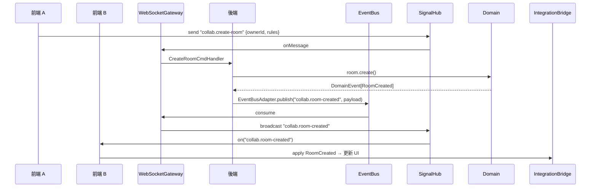

# Collaboration BC — 完整模組設計手冊

> **定位**：管理「房間」的生命周期──建立、加入、離開、房規管理，以及 P2P/WebRTC 信令中繼，並透過 `collab.*` IntegrationEvent 駆動前後端及其他 BC 的 UI 與行為。

---

## 一、核心責任

1. **房間管理**：建立／查詢／修改規則／關閉房間。
    
2. **玩家管理**：處理玩家加入／離開、維護房內成員列表與房規校驗。
    
3. **P2P 信令中繼**：交換 ICE Offer/Answer/Candidate，支援 Mesh & Relay 降級。
    
4. **事件廣播**：只對跨模組／跨端關鍵 Domain Event 發佈 IntegrationEvent。
    
5. **高可用設計**：支持斷線重連、降級至 TURN 或 WebSocket Relay。
    

---

## 二、前後端職責劃分

|層級|前端 (Client)|後端 (Server)|
|---|---|---|
|**Presentation**|- **RoomListPage**：顯示／搜尋／建立／加入房間- **PlayerStatusBadge**：房內成員及連線狀態- **SignalHubAdapter**：訂閱 `collab.*` IntegrationEvent|- **WebSocketGateway** `/ws?roomId&peerId`：分流 `module: collab` + `type`- **REST Controller**：`POST /rooms`、`GET /rooms`、`PATCH /rooms/:id/rules`、`DELETE /rooms/:id`|
|**Application**|- **CommandHandlers**：CreateRoom / JoinRoom / LeaveRoom / UpdateRules- **CollaborationAppService**：協調命令與聚合- **IntegrationBridge**：發佈 & 訂閱 `collab.*`|- **CommandHandlers**：對應 CreateRoom, JoinRoom, LeaveRoom, ChangeRules- **CollaborationService**：Orchestration- **EventBusAdapter**：發佈 `collab.*` IntegrationEvent|
|**Domain**|- **Room Aggregate**- **Peer Entity**- **RoomRuleVO**- **Domain Events**：RoomCreated / PlayerJoined / PlayerLeft / RuleChanged / RoomClosed|- **共用 Domain model**（shared-kernel）- **Domain Events**：同前端- **Specs/Services**：MaxPlayersSpec / ValidRuleSpec|
|**Infrastructure**|- **SignalHubAdapter**：封裝單一 WS- **WebRTCAdapter**：P2P 信令- **HealthMonitorAdapter**：連線監控與降級- **LocalCacheAdapter**：IndexedDB 快取房間狀態|- **WebSocketAdapter**：同一 Gateway，分流 collab 訊息- **EventBusAdapter**：Kafka/Redis- **WebSocketBridge**：EventBus → WS Broadcast- **RoomRepository** / **PeerRepository**|

> **說明**：
> 
> - 前端負責 UI 展示、命令發送、IntegrationEvent 訂閱與發佈；
>     
> - 後端負責信令分發、Room 聚合運行、IntegrationEvent 發佈；
>     
> - Domain 層共用一套模型以保持行為一致。
>     

---

## 三、聚合與模型

|類型 / 分類|定位 / 角色|關鍵屬性|主要行為|不變式 ✔|
|---|---|---|---|---|
|**Room**Aggregate|一個房間|`roomId`, `ownerId`, `players: Set<PeerId>`, `rules: RoomRuleVO`|`create(owner,rules)`, `join(peer)`, `leave(peer)`, `updateRules(rules)`, `close()`|`players.size ≤ rules.maxPlayers`|
|**RoomRuleVO**VO|房間規則|`maxPlayers`, `allowRelay`, `latencyTargetMs`, `opusBitrate`|`isValidFor(nPlayers)`|`1 ≤ maxPlayers ≤ 10`|
|**Peer**Entity|房內成員|`peerId`, `joinedAt: Timestamp`, `iceState`, `relayState`|—|—|

---

## 四、Domain Event ↔ Integration Event

### 4.1 Domain Events

```ts
RoomCreated(roomId, ownerId, rules: RoomRuleVO)
PlayerJoined(roomId, peerId)
PlayerLeft(roomId, peerId)
RoomRuleChanged(roomId, newRules: RoomRuleVO)
RoomClosed(roomId)
```

### 4.2 Integration Events

|Integration Event|Domain Event|消費者|說明|
|---|---|---|---|
|`collab.room-created`|`RoomCreated`|UI / JamSession BC|房間已建立|
|`collab.player-joined`|`PlayerJoined`|UI / JamSession BC|玩家加入|
|`collab.player-left`|`PlayerLeft`|UI / JamSession BC|玩家離開|
|`collab.room-rule-changed`|`RoomRuleChanged`|ConnectionManager / UI|房規更新|
|`collab.room-closed`|`RoomClosed`|All BC / UI|房間已關閉|

> **原則**：僅對跨模組／跨端需同步的事件廣播 IntegrationEvent；如 ICE HealthCheck、Ping/Pong 則本地化處理。

---

## 五、Integration Layer 設計

### 5.1 後端 Integration Layer

- **EventBusAdapter**
    
    - `publish(topic, event)` → Kafka / Redis
        
    - `subscribe(topic, handler)`
        
- **WebSocketBridge**
    
    - 訂閱 `collab.*` topic → `gateway.broadcast(roomId, eventType, payload)`
        

**流程**：

1. CommandHandler → Domain → collectDomainEvents()
    
2. EventBusAdapter.publish(`collab.*`, payload)
    
3. WebSocketBridge.consume → broadcast to WS clients
    

### 5.2 前端 Integration Layer

- **OutboundPublisher**
    
    - `publish(eventType, payload)` → `SignalHubAdapter.send()`
        
- **IntegrationBridge**
    
    - `SignalHubAdapter.on('collab.*', payload => collaborationAppService.applyEvent(...))`
        

**流程**：

1. UI 操作 → CommandHandler → aggregate.raise(DomainEvent)
    
2. OutboundPublisher.send(`collab.*`, payload)
    
3. 其他 peers SignalHub.on → IntegrationBridge → dispatch local DomainCommand/Event
    

---

## 六、端到端消息時序圖



---

## 七、目錄結構建議

```
collaboration-domain/
├─ presentation/
│   ├─ RoomListPage.tsx
│   └─ PlayerStatusBadge.tsx
├─ application/
│   ├─ commands/
│   │   ├─ CreateRoomCommand.ts
│   │   └─ JoinRoomCommand.ts
│   ├─ handlers/
│   │   ├─ CreateRoomHandler.ts
│   │   └─ JoinRoomHandler.ts
│   ├─ CollaborationAppService.ts
│   └─ IntegrationBridge.ts
├─ domain/
│   ├─ aggregates/
│   │   └─ room.ts
│   ├─ entities/
│   │   └─ peer.ts
│   ├─ value-objects/
│   │   └─ room-rule-vo.ts
│   ├─ events/
│   │   └─ room-events.ts
│   └─ specs/
│       └─ max-players.spec.ts
└─ infrastructure/
    ├─ SignalHubAdapter.ts
    ├─ WebSocketAdapter.ts
    ├─ EventBusAdapter.ts
    ├─ WebSocketBridge.ts
    ├─ RoomRepository.ts
    └─ PeerRepository.ts
```

---

## 八、關鍵設計原則

1. **單一可信來源**：後端負責 Room 聚合與規則校驗，前端僅展示與命令發送。
    
2. **必要即廣播**：僅對跨端關鍵事件發佈 IntegrationEvent，減少耦合與流量。
    
3. **冪等與去重**：IntegrationEvent 帶 `eventId, timestamp`，接收端須防重複處理。
    
4. **可恢復**：前端斷線重連後可透過 REST 查詢最新房間狀態並重訂閱 `collab.*` 事件。
    

> 此手冊涵蓋 Collaboration BC 的前後端責任、Domain ↔ Integration 事件映射、Integration Layer 設計、目錄建議與時序，確保團隊能快速對齊並高效落地。