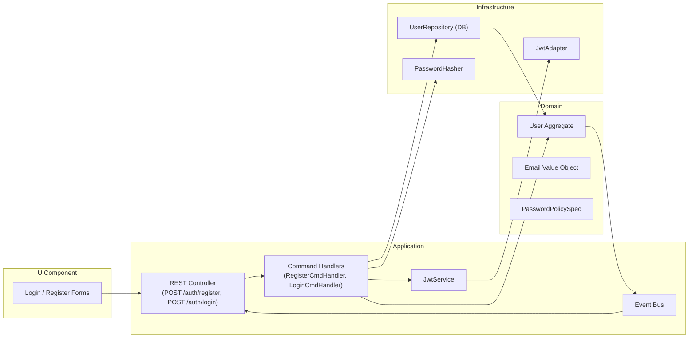

## Identity BC — 模組設計手冊

> **定位**：管理用戶註冊、登入、JWT 發行與驗證，提供全系統統一的身分認證服務。

---

### 1. 聚合與模型

| 類型 / 分類                   | 定位 / 角色                     | 關鍵屬性                                                                                   | 主要行為                                             | 關鍵不變式 ✔                                     |
|-------------------------------|--------------------------------|-------------------------------------------------------------------------------------------|------------------------------------------------------|--------------------------------------------------|
| **User**<br>Aggregate Root    | 系統帳戶                        | `userId` · `email: EmailVO` · `passwordHash: string` · `createdAt: Timestamp` · `status: active｜disabled` | `register(email, password)`<br>`changePassword(old, new)`<br>`disable()` | Email 唯一<br>密碼符合安全策略                  |
| **EmailVO**<br>Value Object   | 電子郵件地址                    | `value: string`                                                                            | `equals(other)`                                      | 格式合法（RFC 驗證）                            |
| **JwtTokenVO**<br>Value Object| JWT 令牌                        | `token: string` · `expiresAt: Timestamp`                                                  | `isValid()`                                          | 簽章合法、未過期                                 |

---

### 2. Domain Events

| 事件名稱                  | 觸發方法                    | 典型 Payload                        |
| --------------------- | ----------------------- | --------------------------------- |
| `UserRegistered`      | `User.register()`       | `{ userId, email, registeredAt }` |
| `UserPasswordChanged` | `User.changePassword()` | `{ userId, changedAt }`           |
| `UserDisabled`        | `User.disable()`        | `{ userId, disabledAt }`          |

> 聚合內 `raise()` → Application 層 `pullDomainEvents()` → 轉成 Integration Events

---

### 3. Integration Events

| 事件名稱                      | Publisher               | Subscriber                 | Payload                         |
|-------------------------------|-------------------------|----------------------------|---------------------------------|
| `identity.user-registered`    | Identity App            | Notification / Audit BC    | `{ userId, email, registeredAt }` |
| `identity.user-password-changed` | Identity App         | Audit BC                   | `{ userId, changedAt }`         |
| `identity.user-disabled`      | Identity App            | Audit BC / Collaboration   | `{ userId, disabledAt }`        |
| `identity.user-authenticated` | Identity App            | API Gateway / UI           | `{ userId, token, expiresAt }`  |

---

### 4. 輔助元件

| 模式               | 範例                                            |
|--------------------|-------------------------------------------------|
| **Specification**  | `PasswordPolicySpec` (長度／複雜度驗證)           |
| **Domain Service** | `JwtService` (簽發、驗證 Token)                  |
| **Factory**        | `UserFactory.createNew(email, passwordPlain)`    |
| **Repository**     | `UserRepository.load/save`                      |
| **Domain Error**   | `DomainError('EMAIL_INVALID')`, `DomainError('PASSWORD_WEAK')` |

---

### 5. ID 生成策略

| 物件     | 格式              | 生成器 (DI)    |
|----------|-------------------|----------------|
| userId   | `UUID v4`         | `UuidGen`      |
| token    | JWT 標準          | `JwtService`   |

---

### 6. 模組關係圖



---
### 7. 目錄建議（pnpm workspace）
```
identity-domain/
├─ aggregates/
│   └─ user.ts
├─ value-objects/
│   ├─ email.ts
│   └─ jwt-token.ts
├─ events/
│   └─ user-events.ts
├─ specs/
│   └─ password-policy.spec.ts
├─ services/
│   └─ jwt-service.ts
├─ factories/
│   └─ user-factory.ts
├─ interfaces/
│   ├─ user-repository.ts
│   └─ password-hasher.ts
├─ errors/
│   └─ domain-error.ts
└─ index.ts
```

---
### 8. 近期落地里程碑

1. **RegisterCmd / LoginCmd 單元測試**
2. **PasswordPolicySpec** 驗證流程
3. **JwtService** 簽發與驗證測試
4. **REST API**：`/auth/register`、`/auth/login` 完整 E2E
5. **IntegrationEvent**：`identity.user-registered` 等流轉