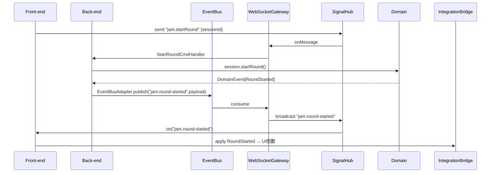

# JamSession BC — 完整模組設計手冊

> **定位**：管理房間內的 Jam 流程──玩家角色配置、Ready 倒數、回合控制，並透過 `jam.*` IntegrationEvent 駆動前後端及其他 BC 的 UI 與行為。

---

## 一、核心責任

1. **房主與玩家管理**：建立／結束 Session，分派角色，維護玩家就緒狀態。  
2. **回合時序控制**：啟動整場 Jam、啟動／結束每回合倒數，保證全端同步。  
3. **事件廣播**：只對跨模組／跨端關鍵 Domain Event 進行 IntegrationEvent 發佈。  
4. **高可用設計**：支持重連、斷線續接、降級策略。

---
## 二、前後端職責劃分

| 層級                 | 前端 (Client)                                                                                                                                                                              | 後端 (Server)                                                                                                                                                                                                   |
| ------------------ | ---------------------------------------------------------------------------------------------------------------------------------------------------------------------------------------- | ------------------------------------------------------------------------------------------------------------------------------------------------------------------------------------------------------------- |
| **Presentation**   | - **SessionPage**：RoleSelector、ReadyButton、CountdownTimer、RoundDisplay<br>- **SignalHubAdapter**：on(‘collab.*’ / ‘jam.*’)                                                                | - **WebSocketGateway** `/ws?roomId&peerId`：分流 `module: collab/jam` + `type`<br>- **REST Controller**：CRUD `/rooms`、`/sessions`                                                                                |
| **Application**    | - **CommandHandlers**：CreateRoom / JoinRoom / SetRole / ToggleReady / StartSession / StartRound / EndRound<br>- **SessionAppService**<br>- **IntegrationBridge**：發/訂閱 `collab.*`、`jam.*` | - **CommandHandlers**：對應所有 collab/jam Cmds<br>- **CollaborationService** + **SessionService**<br>- **EventBusAdapter**：發佈 `collab.*`、`jam.*`                                                                  |
| **Domain**         | - **Room & Session Aggregates**<br>- **Peer & PlayerState Entities**<br>- **VOs**：RoomRuleVO / RoleVO / RoundVO<br>- **Domain Events**：RoomCreated… / PlayerRoleSet… / RoundStarted…     | - **同前端 Domain model**（shared-kernel）<br>- **Domain Events**：同前端<br>- **Specs/Services**：MaxPlayersSpec / AllPlayersReadySpec / CountdownService                                                              |
| **Infrastructure** | - **SignalHubAdapter**：封裝單一 WS<br>- **WebRTCAdapter**：P2P 打洞 & DataChannel<br>- **TimerAdapter** / **HealthMonitorAdapter**<br>- **LocalCacheAdapter**                                   | - **WebSocketAdapter**：同一 Gateway，依 module/type 分流<br>- **EventBusAdapter**：Kafka/Redis<br>- **WebSocketBridge**：EventBus → WS Broadcast<br>- **Repositories**：RoomRepo / SessionRepo<br>- **TimerScheduler** |
> **說明**：  
> - 前端主要負責 UI 展示、命令發送與 IntegrationEvent 訂閱；  
> - 後端負責信令分發、Session 聚合運行與 IntegrationEvent 發佈；  
> - Domain 層可共用一套模型以保持行為一致性。  

---

## 三、聚合與模型

| 類型 / 分類                   | 定位 / 角色                  | 關鍵屬性                                                                 | 主要行為                      | 不變式 ✔                                                            |                                                                |                           |
| ------------------------- | ------------------------ | -------------------------------------------------------------------- | ------------------------- | ---------------------------------------------------------------- | -------------------------------------------------------------- | ------------------------- |
| **Session**<br>Aggregate  | 一場 JamSession（對應一個 Room） | `sessionId`, `roomId`, `status(pending                               | inProgress                | ended)`, `players: Map<peerId,PlayerState>`, `rounds: RoundVO[]` | `startSession()`, `endSession()`, `startRound()`, `endRound()` | 只能在 `pending` 啟動；回合序號不可跳號 |
| **PlayerState**<br>Entity | 某位玩家於本場 Session 的狀態      | `peerId`, `role?: RoleVO`, `isReady: boolean`, `joinedAt: Timestamp` | `setRole()`, `setReady()` | 角色僅在 `pending` 可設定；Ready 需先設定角色                                  |                                                                |                           |
| **RoleVO**<br>VO          | 玩家角色                     | `id: string`, `name: string`, `color: string`                        | `equals()`                | 同一角色 ID 只能一人持有                                                   |                                                                |                           |
| **RoundVO**<br>VO         | 單回合元資料                   | `roundId`, `startedAt: Timestamp`, `endedAt?: Timestamp`             | `duration()`              | 完成後 `startedAt < endedAt`                                        |                                                                |                           |

---

## 四、Domain Event ↔ Integration Event

### 4.1 Domain Events

```ts
PlayerRoleSet(sessionId, peerId, role: RoleVO)
PlayerReadyToggled(sessionId, peerId, isReady: boolean)
SessionStarted(sessionId, startTime: Timestamp)
RoundStarted(sessionId, roundId, startTime: Timestamp)
RoundEnded(sessionId, roundId, endTime: Timestamp)
SessionEnded(sessionId, endTime: Timestamp)
```
### 4.2 Integration Events

|Integration Event|Domain Event|消費者|說明|
|---|---|---|---|
|`jam.player-role-set`|`PlayerRoleSet`|UI / CollaborationBridge|角色分派|
|`jam.player-ready`|`PlayerReadyToggled`|UI / CollaborationBridge|就緒切換|
|`jam.session-started`|`SessionStarted`|UI / MusicArrangement|Jam 開始|
|`jam.round-started`|`RoundStarted`|UI / MusicArrangement|回合開始|
|`jam.round-ended`|`RoundEnded`|UI / MusicArrangement|回合結束|
|`jam.session-ended`|`SessionEnded`|UI / CollaborationBridge|Jam 結束|

> **原則**：僅對「跨模組／跨端需同步」的 Domain Event 廣播 Integration Event；像倒數每秒 Tick 類事件保持本地化。

---

## 五、Integration Layer 設計

### 5.1 後端 Integration Layer

- **EventBusAdapter**
    - `publish(topic, event)` → Kafka / Redis
    - `subscribe(topic, handler)`
        
- **WebSocketBridge**
    - 訂閱 `jam.*` topic → `gateway.broadcast(sessionId, eventType, payload)`

流程：
1. CommandHandler → Domain → collectDomainEvents()
2. EventBusAdapter.publish(`jam.*`, payload)
3. WebSocketBridge.consume → push WS to all peers

### 5.2 前端 Integration Layer

- **OutboundPublisher**
    - `publish(eventType, payload)` → `SignalHubAdapter.send()`
        
- **IntegrationBridge**
    - `SignalHubAdapter.on('jam.*', payload => sessionAppService.applyEvent(...))`

流程：

1. UI 操作 → CommandHandler → DomainAggregate.raise()
2. OutboundPublisher.send(`jam.*`, payload)
3. 其他 peers SignalHub.on → IntegrationBridge → DomainCommand
### 六、端到端消息時序圖


---
## 七、目錄結構建議

```
jam-session-domain/
├─ presentation/
│   ├─ SessionPage.tsx
│   ├─ RoleSelector.tsx
│   ├─ ReadyButton.tsx
│   ├─ CountdownTimer.tsx
│   └─ RoundDisplay.tsx
├─ application/
│   ├─ commands/
│   │   └─ SetRoleCommand.ts
│   ├─ handlers/
│   │   └─ SetRoleHandler.ts
│   ├─ SessionAppService.ts
│   └─ IntegrationBridge.ts
├─ domain/
│   ├─ aggregates/
│   │   └─ Session.ts
│   ├─ entities/
│   │   └─ PlayerState.ts
│   ├─ value-objects/
│   │   ├─ RoleVO.ts
│   │   └─ RoundVO.ts
│   ├─ events/
│   │   └─ session-events.ts
│   └─ specs/
│       └─ AllPlayersReadySpec.ts
└─ infrastructure/
    ├─ SignalHubAdapter.ts
    ├─ WebSocketAdapter.ts
    ├─ EventBusAdapter.ts
    ├─ WebSocketBridge.ts
    ├─ TimerScheduler.ts
    └─ SessionRepository.ts

```

---
## 八、關鍵設計原則

1. **單一可信來源**：Session 狀態與倒數邏輯由後端負責，前端僅作展示與指令發送。
    
2. **必要即廣播**：僅對跨端關鍵事件發 IntegrationEvent，避免流量與耦合過度。
    
3. **冪等與去重**：所有 IntegrationEvent 帶 `eventId`、`timestamp`，接收端需過濾重複。
    
4. **可恢復**：前端重連後可透過 REST 讀取當前 Session 狀態並訂閱後端 `jam.*` 新事件。
    

> 此手冊涵蓋 JamSession BC 的前後端責任、Domain ↔ Integration 事件映射、Integration Layer 設計、目錄建議與時序，確保團隊能快速對齊並高效落地。