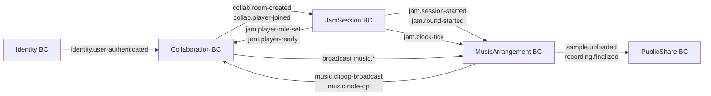

# Echlub MVP 系統規劃（2025-06-04 版 v5）

> **更新重點**
> 
> 1. 前端採用 Clean Architecture + DDD 四層（Presentation / Application / Domain / Infrastructure）
>     
> 2. 錄音策略改為 **單流 Opus（WebRTC）**——即時聽、即時存；暫不實作雙流高母帶
>     
> 3. Collaboration BC 增補「事件審計」與「指標 API」職責
>     
> 4. JamSession BC 同步新增「事件審計」與「Metrics API」職責，強化整體可觀測性
>     
> 5. 其餘時程與核心目標維持不變
>     

---

## 🎯 系統總體設計

### 前端（主體系統） — Clean Arch Layers

|BC|Presentation|Application|Domain|Infrastructure|
|---|---|---|---|---|
|**Identity BC**|LoginPage / RegisterPage|`LoginCommandHandler`|`User` Aggregate|JWT Adapter / LocalStorage|
|**Collaboration BC**|RoomListPage / PlayerStatusBadge|Create/Join/Leave/ChangeRule Commands`CollaborationAppService`|`Room` Aggregate / `Peer` / `RoomRuleVO`|SignalHubAdapter / WebRTCAdapter / HealthMonitorAdapter / LocalCacheAdapter|
|**JamSession BC**|SessionReadyBoard / CountdownTimer|SetRole/ToggleReady/StartSession/StartRound/EndRound Commands`JamSessionAppService`|`JamSession` Aggregate / `PlayerState` / `RoleVO` / `RoundVO`|Shared WS Adapter / TimerAdapter / LocalCacheAdapter|
|**MusicArrangement BC**|TimelinePage / ClipComponent / TrackComponent / RecorderButton / PlayButton|Clip Commands / `MusicArrangementService`|`Track` Aggregate / `AudioClipVO` / `MidiClip` / `MidiNote`|WebRTC DataChannel Adapter + Tone.js|
|**PublicShare BC**|SharePage (QR, 播放控制)|`LoadMixQuery`|Read-only DTO|REST Fetch / QR Lib|

### 後端（極簡支援）

|Module|功能|備註|
|---|---|---|
|**Identity**|註冊、登入、JWT|.API / Application / Domain / Infra|
|**Collaboration**|房間 CRUD、加入/離開、P2P 信令中繼、事件記錄、審計、Metrics API|DataChannel 信令 + WebSocketRelayEventBus + LoggingAdapter + MetricsAdapter|
|**JamSession**|Session CRUD、角色/Ready/回合管理、事件記錄、Metrics API|WebSocket + REST Cmd + EventBus + Logging + Metrics|
|_(其他 BC 後端 MVP 先不實作)_|||

---

## ✅ 功能總覽

|模組|功能|必要 UI|
|---|---|---|
|Identity|註冊、登入、登入狀態管理|LoginPage, RegisterPage|
|Collaboration|建房/加房/離房、房規管理、P2P 信令中繼、事件審計、指標查詢|RoomListPage, PlayerStatusBadge; Metrics API|
|JamSession|Session 建/查/刪、角色選擇、Ready 切換、倒數、回合管理、事件審計、指標查詢|SessionReadyBoard, CountdownTimer; Metrics API|
|MusicArrangement|Track/Clip 編輯、錄音、播放、本地同步|TimelinePage, ClipComponent, TrackComponent, RecorderButton, PlayButton|
|PublicShare|成品回放、QR 生成|SharePage|

---

## ✅ MVP 時程表

|週次|時段|主要交付|
|---|---|---|
|0|4/29|✔ 架構、UI 草稿|
|1|4/30–5/5|Identity (前後端) + Login/Register|
|2|5/6–5/12|Collaboration BC：房間 CRUD + RoomListPage + P2P 信令雛形 + 事件審計與 Metrics API 設計|
|3|5/13–5/19|JamSession BC：Session CRUD + Ready/Role + 倒數原型 → 後端倒數 & Metrics API 整合|
|4|5/20–5/26|MusicArrangement BC：Track/Clip 編輯 + Opus 錄音/播放|
|5|5/27–6/2|P2P Clip 同步 + WS 音訊 chunk 備份 + PublicShare 基本回放|
|預備|6/3–6/4|整合測試 + 最終 Demo|

---

## ✅ 資料流設計

### 登入

`LoginPage → POST /auth/login → JWT → localStorage → userId`

### Collaboration 房間流程

1. **REST CRUD**：`/rooms` → 後端 `Room.create/join/leave/changeRules()` → DomainEvent → IntegrationEvent → WS clients 更新 UI
    
2. **P2P 信令中繼**：SignalHubAdapter.send(type, payload) → WebSocketGateway → CollaborationService → EventBus → WebSocketBridge → peers
    
3. **事件審計**：LoggingAdapter 同步所有 DomainEvent/IntegrationEvent 至審計日誌
    
4. **指標查詢**：MetricsAdapter 收集指標並提供 `GET /rooms/:id/metrics`
    

### JamSession 流程

1. **Session CRUD**：REST `/sessions` → 後端 `Session.create/start/end()` → DomainEvent → IntegrationEvent → WS clients
    
2. **角色/Ready**：`SetRole`/`ToggleReady` Cmd → SessionService → EventBus → 宏觀狀態更新
    
3. **回合倒數**：CountdownService → DomainEvent(RoundStarted) → MetricsAdapter 紀錄 → IntegrationEvent → UI 倒數
    
4. **事件審計 & 指標**：LoggingAdapter & MetricsAdapter 全程打點
    

### Clip 操作 (P2P) & 錄音流程

同前：DataChannel 廣播 ClipOp；MediaRecorder.ondataavailable → WS 備份。

---

## ✅ 技術特別注意事項

- **延遲目標**：≤ 50 ms（Opus 64 kbps）
    
- **大檔失敗**：自動降級到 WebSocket Relay
    
- **後端職責**：Collaboration + JamSession 審計與指標 API，MusicArrangement 僅做 chunk 備份
    
- **安全 & 驗證**：REST/WS API 均需校驗 `userId` & `roomId/sessionId` 權限
    
- **可觀測性**：所有關鍵事件打點帶 `traceId`、`timestamp`；支持重試 & 去重
    

---

## 🔥 Demo 驗收

1. 4 人登入 → 建/加房 → 選角色 → Ready 倒數
    
2. 兩輪 8 小節 Jam：即時聽/同步 Clip；Metrics API 可查回合時長、降級次數
    
3. Opus chunk 備份成功後端，審計日誌 & 指標可查
    
4. Share URL/QR → 回放流程驗證
    

---

## 🚧 降規策略

| 風險           | 降規方案                       |
| ------------ | -------------------------- |
| WebRTC 失敗    | 全房改 WebSocket Relay        |
| 播放不同步        | 以房主為時鐘 `currentTime` 校正    |
| 前端 Render 不及 | Demo 播前端即時混音               |
| 指標系統故障       | 暫時關閉 Metrics API，僅保留審計日誌存儲 |

---

> **開發原則**：scope first；必要時立刻降規，確保 6/4 Demo 成功。

### 互動關係圖

