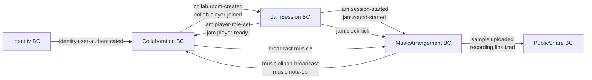

# Echlub MVP 系統規劃（2025-06-04 版 v3）

> **更新重點**  
> 1. 前端採用 Clean Architecture + DDD 四層（Presentation / Application / Domain / Infrastructure）  
> 2. 錄音策略改為 **單流 Opus（WebRTC）** —— 即時聽、即時存；暫不實作雙流高母帶  
> 3. 其餘時程與核心目標維持不變

---

## 🎯 系統總體設計

### 前端（主體系統） — Clean Arch Layers  
| BC                      | Presentation                             | Application                     | Domain                                 | Infrastructure                       |
| ----------------------- | ---------------------------------------- | ------------------------------- | -------------------------------------- | ------------------------------------ |
| **[[Identity BC]]**     | LoginPage / RegisterPage                 | `LoginCommandHandler` …         | `User` Aggregate                       | JWT Adapter / LocalStorage           |
| **[[Collaboration BC]]**    | RoomListPage / PlayerStatus              | `CreateRoomCmd` `JoinRoomCmd`   | `Room` Entity                          | REST Gateway / WS Hub                |
| **[[JamSession BC]]**   | SessionReadyBoard / Countdown            | `SetRoleCmd` `ReadyCmd`         | `JamSession` Aggregate (state machine) | WebSocket Adapter                    |
| **[[MusicArrangement BC]]** | Timeline / Clip / Track / Rec & Play Btn | `CreateClipCmd` `MoveClipCmd` … | `Track`, `Clip` VO                     | WebRTC DataChannel Adapter + Tone.js |
| **[[PublicShare BC]]**  | SharePage (QR)                           | `LoadMixQuery`                  | Read-only DTO                          | REST Fetch / QR Lib                  |

### 後端（極簡支援）

| Module                                                          | 功能                  | 備註                                  |
| --------------------------------------------------------------- | ------------------- | ----------------------------------- |
| **Identity**                                                    | 註冊、登入、JWT           | .API / Application / Domain / Infra |
| **Collaboration**                                               | 房間建立、加入、P2P 信令、事件記錄 | DataChannel 信令 + WebSocket Relay    |
| _(AssetStorage / RenderOutput / PublicShare 等仍留作後續擴充，MVP 先不實作)_ |                     |                                     |

---

## ✅ 功能總覽

| 模組               | 功能                         | 必要 UI                                                                   |
| ---------------- | -------------------------- | ----------------------------------------------------------------------- |
| Identity         | 註冊、登入、登入狀態管理               | LoginPage, RegisterPage                                                 |
| Collaboration    | 建房 / 加房、P2P 信令、玩家列表        | RoomListPage, PlayerStatusBadge                                         |
| JamSession       | 角色選位、Ready 倒數、回合管理         | SessionReadyBoard                                                       |
| MusicArrangement | Track / Clip 編輯、錄音、播放、本地同步 | TimelinePage, ClipComponent, TrackComponent, RecorderButton, PlayButton |
| PublicShare      | 成品播放、QR                    | SharePage                                                               |

---

## ✅ MVP 時程表

| 週次 | 時段 | 主要交付 |
|------|------|-----------|
| 0 | 4/29 | ✔ 架構、UI 草稿 |
| 1 | 4/30–5/5 | Identity (前後端) + Login/Register |
| 2 | 5/6–5/12 | 建房 / 加房 + RoomListPage + WebRTC 信令雛形 |
| 3 | 5/13–5/19 | JamSession Ready/Role + 倒數 |
| 4 | 5/20–5/26 | MusicArrangement Track/Clip + Opus 錄音 / 播放 |
| 5 | 5/27–6/2 | P2P Clip 同步 + WS 錄音 chunk 備份 |
| 預備 | 6/3–6/4 | 整合測試 + Demo Flow |

---

## ✅ 資料流設計

### 登入
`LoginPage → POST /auth/login → JWT → localStorage → userId`

### 房間建立 / 加入
1. `/rooms/create` or `/rooms/join`
2. 回傳 `roomId`
3. WebRTC DataChannel (Opus Track + ClipOp JSON)
4. WebSocket (錄音備份 & 心跳)

### Clip 操作 (P2P)
1. 本地 `CreateClip` / `MoveClip`
2. 透過 DataChannel 廣播 `ClipOp`
3. 對端更新本地 Store

### 錄音流程
1. MediaRecorder (Opus 48 kHz, VBR) → WebRTC 音訊 Track（即時監聽）  
2. 同時每 5 s `MediaRecorder.ondataavailable` 產生 Opus chunk → WebSocket 備份至後端

---

## ✅ 技術特別注意事項

* 延遲目標：**≤ 50 ms**（Opus 64 kbps）
* 大檔失敗 → 自動改走 WebSocket 直傳
* 後端只做 **chunk 落地備份**，不參與 Jam 節奏控制
* 回合鎖定：ClipOp 需攜帶 `roundId`，非當前回合丟棄

---

## 🔥 Demo 驗收

	1. 4 人登入 → 選角色 → Ready 倒數
1. 兩輪 8 小節 Jam  
   * 即時聽到彼此演奏  
   * Clip 拖拉同步
3. Opus chunk 備份成功落後端
4. Share URL / QR 可播放回放（前端合混即可）

---

## 🚧 降規策略

| 風險        | 降規方案                     |
| --------- | ------------------------ |
| WebRTC 失敗 | 全房改 WebSocket Relay      |
| 播放不同步     | 以房主為主時鐘 `currentTime` 校正 |
| Render 不及 | Demo 播前端即時混音             |

---

> **開發原則**：scope first；任何卡點先降規，保證 6/4 Demo 成功。

### 互動關係圖
