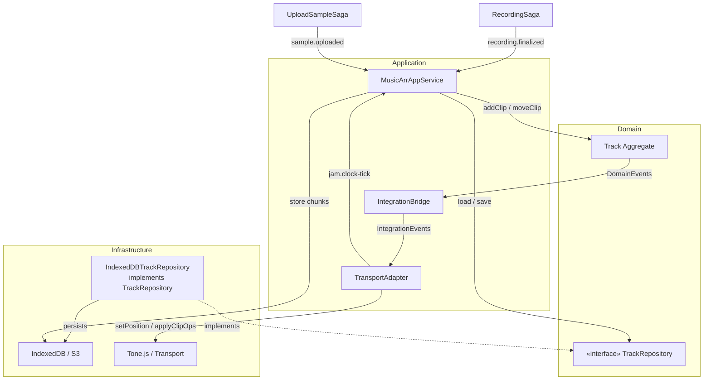

## MusicArrangement BC — Domain 設計總覽

> *更新*：  
> 1. **移除** MIDI 相關功能 (MidiClip / MidiNote)  
> 2. **Domain Event** 與 **Integration Event** 表格已更新

---

### 1. 聚合與模型

| 類型 / 分類                       | 定位 / 角色        | 關鍵屬性 (※ = VO 欄位)                                                                              | 主要行為 / 純函式                       | 關鍵不變式 ✔                    |
| ----------------------------- | -------------- | --------------------------------------------------------------------------------------------- | ---------------------------------- | -------------------------- |
| **Track**<br>*Aggregate Root* | 一條時間軸          | `trackId` · `ownerId: PeerId` · `clips: Map<ClipId, AudioClipVO>`                               | `addClip(range, source)`<br>`moveClip(id, newStart)`<br>`removeClip(id)` | Clip 彼此不得重疊             |
| **AudioClipVO**               | 錄音 / Sample 片段 | `source: AudioSourceRef*`<br>`range: TimeRangeVO*`<br>`gain?` `fadeIn?` `fadeOut?` `status`     | *不可變* — 透過 `replace()` 回傳新 VO    | `start ≥ 0`，`length > 0`  |
| **TimeRangeVO**               | 區段值物件          | `start` · `length`                                                                            | `end()` · `intersects(other)` · `shift(dx)` | `start ≥ 0`，`length > 0`  |
| **AudioSourceRef**            | 音訊來源指標 VO      | `{type:'sample'; sampleId; status}`<br>`{type:'recording'; recordingId}`                      | `isSynced()` · `sameSource(a,b)`        | `status ∈ {pending,synced}` |
| **Bpm**<br>*Value Object*     | 節拍速度值物件       | `value` (BPM)                                                                                 | `msPerBeat() → 60000 / value`          | `30 ≤ value ≤ 300`         |

---

### 2. Domain Events（模組內）

| 事件名稱       | 觸發方法             | 典型 Payload            |
|--------------|--------------------|------------------------|
| `ClipAdded`   | `Track.addClip()`   | `{ clipSnapshot }`     |
| `ClipMoved`   | `Track.moveClip()`  | `{ clipId, newStart }` |
| `ClipReplaced`| `Track.replaceClip()`| `{ oldSnap, newSnap }` |
| `ClipRemoved` | `Track.removeClip()`| `{ clipId }`           |

> Application Layer 監聽這些 Event，轉封裝為跨 BC 的 **Integration Event**。

---

### 3. Integration Events（跨 BC / 跨層）

| 事件名稱                  | 來源 BC (Publisher)        | 消費者 (Subscriber)         | Payload 摘要                                  |
|---------------------------|----------------------------|-----------------------------|----------------------------------------------|
| `music.clipop-broadcast`  | **MusicArrangement App**   | 他端 MusicArrangement       | 序列化 `ClipAdded / ClipMoved / ClipReplaced` |
| `jam.clock-tick`          | **JamSession BC**          | TransportAdapter (本 BC)    | `{ positionSeconds }`                         |
| `jam.round-started`/`ended`| **JamSession BC**         | MusicArrangement            | `{ roundId, tempo, bars }`                    |
| `sample.uploaded`         | UploadSampleSaga           | MusicArrangement            | `{ tempId, officialId }`                      |
| `recording.finalized`     | RecordingSaga (backend)    | MusicArrangement            | `{ recordingId, finalUrl }`                   |

---

### 4. 輔助積木

| 模式                | 範例                                 |
|--------------------|--------------------------------------|
| **Specification**  | `NoOverlapSpec`, `InsideRoundSpec`   |
| **Domain Service** | `QuantizeService`, `BpmService`      |
| **Factory**        | `AudioClipFactory.fromSample()`      |
| **Repository (介面)** | `TrackRepository.load()/save()`    |
| **Domain Error**   | `DomainError('CLIP_OVERLAP')`        |

---

### 5. ID 生成策略

| 物件                | 格式             | 生成器 (DI)         |
|---------------------|------------------|---------------------|
| TrackId / ClipId    | `nanoid(10)`     | `RandomIdGen`       |
| AudioSourceRef Id   | `UUID v4`        | `AudioSourceIdGen`  |
| RecordingId         | `{sessionId}-{nanoid(8)}` | `RecordingIdGen` |

---

### 6. 檔案／時鐘與 Domain 關係圖



---
### 7. 目錄建議（pnpm workspace）
```
music-arrangement-domain/
├─ aggregates/
│  └─ track.ts
├─ value-objects/
│  ├─ audio-clip-vo.ts
│  ├─ time-range.ts
│  ├─ audio-source-ref.ts
│  └─ bpm.ts
├─ events/
│  └─ clip-events.ts
├─ specs/
│  ├─ no-overlap.spec.ts
│  └─ inside-round.spec.ts
├─ services/
│  └─ quantize-service.ts
├─ factories/
│  └─ audio-clip-factory.ts
├─ interfaces/
│  └─ track-repository.ts
├─ errors/
│  └─ domain-error.ts
	└─ index.ts
```

---

### 8. 近期落地里程碑

1. **Track.addClip / moveClip 單元測試**　（重疊即拋錯）  
2. **DomainEvent → IntegrationEvent**　（ClipAdded → `music.clipop-broadcast`）  
3. **In-memory Repository + IndexedDB Adapter**　可 Replay  
4. **TransportAdapter**　訂閱 `jam.clock-tick` → 控制 Tone.js 播放
5. **E2E Demo**：4 人即時 Clip 編排 + 音訊回放