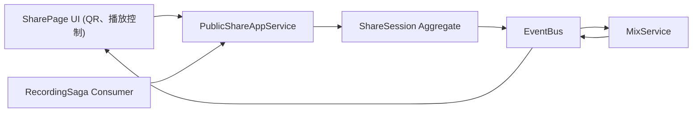

## PublicShare BC — 模組設計手冊

> **定位**：負責「生成分享頁面」與「前端合混回放」功能──接收錄音 chunk、將多路音訊合成 Mix、並提供播放控制與 QR 下載。

---

### 1. 聚合與模型

| 類型 / 分類                          | 定位 / 角色  | 關鍵屬性                                                                              | 主要行為                               | 不變式 ✔                           |
| -------------------------------- | -------- | --------------------------------------------------------------------------------- | ---------------------------------- | ------------------------------- |
| **ShareSession**<br>Agg Root     | 一次分享回放流程 | `shareId` · `sessionId` · `status: idle｜mixing｜ready` · `mixBuffer?: AudioBuffer` | `startMix()`，`completeMix(buffer)` | 只能從 `idle` → `mixing` → `ready` |
| **ShareSettingsVO**<br>Value Obj | 分享配置     | `includeRounds: boolean` · `playbackRate: number`                                 | `equals(other)`                    | `playbackRate > 0`              |
| **MixProgress**<br>Value Obj     | 合混進度     | `progress: 0–1`                                                                   | `toPercent()`                      | `0 ≤ progress ≤ 1`              |

---

### 2. Domain Events

| 事件名稱             | 觸發方法                         | 典型 Payload                          |
|----------------------|----------------------------------|---------------------------------------|
| `MixStarted`         | `ShareSession.startMix()`        | `{ shareId, sessionId }`              |
| `MixProgressUpdated` | `MixService.updateProgress()`    | `{ shareId, progress }`               |
| `MixCompleted`       | `ShareSession.completeMix()`     | `{ shareId, mixBuffer }`              |

> 聚合內 `raise()` → Application pull → Integration → UI

---

### 3. Integration Events

| 事件名稱                   | Publisher                   | Subscriber                    | Payload                          |
|----------------------------|-----------------------------|-------------------------------|----------------------------------|
| `share.mix-started`        | PublicShare App            | UI / Analytics                | `{ shareId, sessionId }`         |
| `share.mix-progress`       | PublicShare App            | UI                            | `{ shareId, progress }`          |
| `share.mix-completed`      | PublicShare App            | UI                            | `{ shareId, playbackUrl }`       |
| `recording.finalized`      | RecordingSaga (backend)     | PublicShare App               | `{ recordingId, chunkUrls[] }`   |

---

### 4. 輔助元件

| 模式               | 範例                                     |
|--------------------|------------------------------------------|
| **Domain Service** | `MixService`（負責把 chunk 合併成 AudioBuffer） |
| **Factory**        | `ShareSessionFactory.create(sessionId)`  |
| **Repository**     | `ShareSessionRepository.load/save`       |
| **Domain Error**   | `DomainError('INVALID_STATE')`           |

---

### 5. ID 生成策略

| 物件      | 格式                   | 生成器 (DI)     |
|-----------|------------------------|-----------------|
| shareId   | `nanoid(8)`            | `RandomIdGen`   |
| sessionId | 與 JamSession 共用      | `SessionIdGen`  |

---

### 6. 模組關係圖


  ---
### 7. 目錄建議（pnpm workspace）
```
public-share-domain/
├─ aggregates/
│   └─ share-session.ts
├─ value-objects/
│   ├─ share-settings.ts
│   └─ mix-progress.ts
├─ events/
│   └─ share-events.ts
├─ services/
│   └─ mix-service.ts
├─ factories/
│   └─ share-session-factory.ts
├─ interfaces/
│   └─ share-session-repository.ts
├─ errors/
│   └─ domain-error.ts
└─ index.ts
```

---
### 8. 近期落地里程碑
1. **ShareSession.create + MixStarted / MixCompleted** 單元測試
2. **MixService** 實作：前端合混多路 chunk → AudioBuffer
3. **Integration Bridge**：監聽 `recording.finalized` 自動 `startMix`
4. **SharePage**：QR 生成、播放控制、進度顯示
5. **E2E Demo**：錄音完成 → 自動合混 → 顯示可分享連結 + QR → 回放 Mix